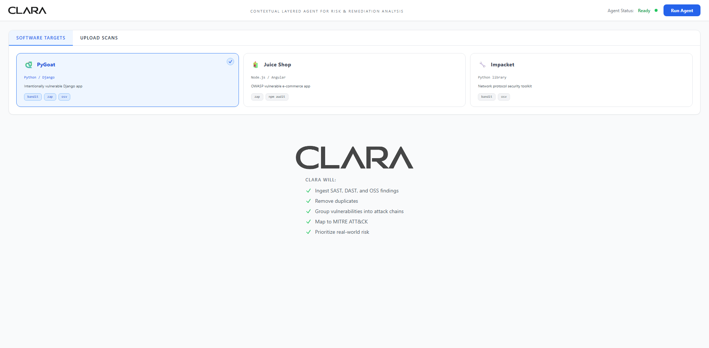
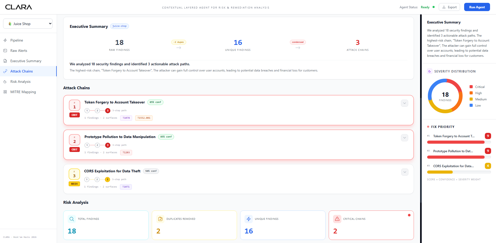
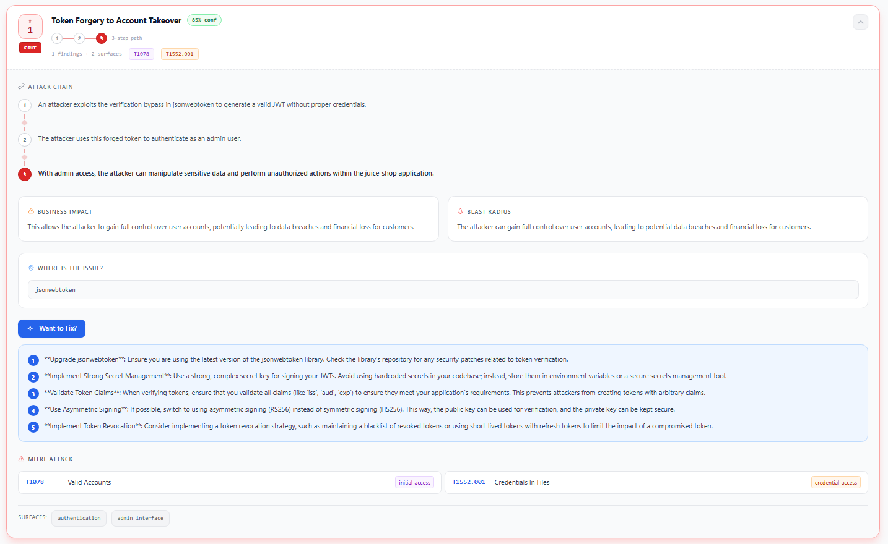
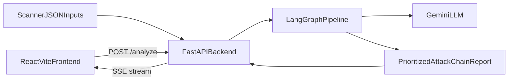
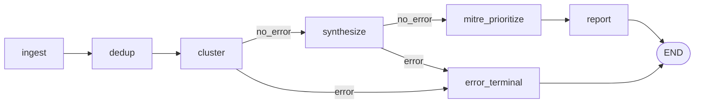

# CLARA - Contextual Layered Agent for Risk & Remediation Analysis

Hook'em Hacks 2026 project that turns noisy scanner output into developer-ready attack chains.  
CLARA ingests SAST/DAST/OSS JSON, deduplicates and clusters findings, synthesizes realistic attack paths, maps to MITRE ATT&CK, and returns prioritized remediation context.

## Live Demo

- App: [https://claragot.us](https://claragot.us)
- Walkthrough video: [https://youtu.be/fpPNLCl3Ljo](https://youtu.be/fpPNLCl3Ljo)

### API budget note

The hosted deployment currently has about **$5 total API credit** attached.  
With normal/light traffic it should usually remain available, but heavy usage could exhaust the credits sooner than expected.

## Video Walkthrough

Here is a full walkthrough of our project:

[](https://youtu.be/fpPNLCl3Ljo)

## UI Screenshots

For viewers who cannot access the live deployment or watch the live demo, here are key UI snapshots:

<br />
Homepage view where you can pick a target and run analysis using the three testing sources/tools (SAST, DAST, and OSS findings).

<br />
Post-scan dashboard showing the executive summary, three attack chains, risk analysis, and the summary panel on the right.

<br />
Expanded attack-chain dropdown with detailed context and an AI-generated fix insight option for remediation support.

## Architecture

### System flow



### Pipeline graph



## What each stage does

- `ingest`: Parse scanner exports into a normalized finding schema.
- `dedup`: Remove repeated findings and keep strongest severity signal.
- `cluster`: Assign findings to attack surfaces (auth, data, network, etc.).
- `synthesize`: Build chain narratives that connect exploitable weaknesses.
- `mitre_prioritize`: Map techniques and rank by fix priority/risk.
- `report`: Return executive summary, stats, findings, and attack chains.

## Supported Targets

| Target | Stack | Scan Types |
|---|---|---|
| `pygoat` | Python / Django | Bandit + ZAP + OSV |
| `juice-shop` | Node.js / Angular | ZAP + npm audit |
| `impacket` | Python library | Bandit + OSV |
| `custom` | User-uploaded scan files | Upload flow in UI |

## Local Quick Start

### Backend

```bash
cd backend
pip install -r requirements.txt
cp .env.example .env
# set GEMINI_API_KEY in .env
uvicorn main:app --reload
```

### Frontend

```bash
cd frontend
npm install
npm run dev
```

Then open `http://localhost:5173`, choose a target (or upload scans), and click **Run Agent**.

## Demo Mode (API-driven)

The backend supports demo replay using cached golden reports.  
Current UI does not expose a demo toggle button, so use the API request payload:

```bash
curl -X POST http://localhost:8000/analyze ^
  -H "Content-Type: application/json" ^
  -d "{\"target\":\"pygoat\",\"demo\":true}"
```

If a golden file exists, CLARA replays cached output instead of calling Gemini.

## Deployment

- Backend uses `uvicorn main:app --host 0.0.0.0 --port $PORT` (see `backend/railway.json`).
- Frontend can target a remote API using `VITE_API_URL`.
